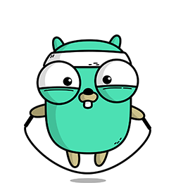


  <samp>
    

      Greetings, I'm Testing
    

  </samp>

  

  

 

 

<!-- 

  

    <samp>
      <b>More Info</b>
    </samp>
  
 -->

 
 

   &nbsp; 

  

  

<!--   -->

  
  

 

  

    
  

 

  

  

    <samp>
      ✩ <a href="https://github.com/onlytesting-user/setup_for_languages">settings</a> ⊹
      <a href="https://github.com/onlytesting-user/ultim4te">oh-my-posh</a> ⊹
      <a href="https://github.com/CodeAmbient/video-guides/blob/main/01-turning-vscode-into-neovim/keybindings.json">keybindings</a> ✩
    </samp>
  

