DevOps enthusiast focused on building scalable, reliable, and automated systems. Experienced with containerization, CI/CD pipelines, and Linux-based environments, with a strong interest in improving deployment efficiency and system stability.

Driven by continuous improvement, I focus on creating streamlined workflows, reducing manual processes, and ensuring consistent and maintainable infrastructure.

> “We can only see a short distance ahead, but we can see plenty there that needs to be done.”
**— Alan Turing**

### Connect with me!

### My Stack

  

### GitHub Stats

  
  

