<h1 align="center">:wave: Hello there! I'm João Victor</h1>

<h3>I'm a Fullstack Developer</h3>

<picture>
  <source srcset="../profile/dark-stats.svg" media="(prefers-color-scheme: dark)" />
  <source srcset="../profile/light-stats.svg" media="(prefers-color-scheme: light)" />
  
</picture>

- :office: &nbsp;I'm working at **[Myself]**
- :seedling: &nbsp;I’m currently learning **Terraform**
- :book: &nbsp;Know about my experiences on my **[Resume]**
- :speech_balloon: &nbsp;I like to talk about **Database** and **Infrastructure**
- :mailbox: &nbsp;Ask me anything on my **[Issues page]**
- :zap: &nbsp;I'm automating something now!

 

### :globe_with_meridians: Connect with me!

> Professional channels for networking and collaboration.

### :hammer_and_wrench: Tech Stack

> My current technical toolkit and preferred technologies.

<table width="100%" border="0" align="center">
  <tr>
    <td width="80%" align="center" valign="top">
      <picture>
        <source srcset="../profile/dark-langs.svg" media="(prefers-color-scheme: dark)" />
        <source srcset="../profile/light-langs.svg" media="(prefers-color-scheme: light)" />
        
      </picture>
    </td>
    <td width="80%" align="center" valign="top">
      <b>Backend</b>
      

        
      

      <b>Frontend</b>
      

        
      

      <b>Infrastructure & Cloud</b>
      

        
      

      <b>Data</b>
      

        
      

    </td>

  </tr>
</table>

<!-- Links -->

[Myself]: https://github.com/onlytesting-user/Readme_Code
[Issues page]: https://github.com/onlytesting-user/Readme_Code/issues
[Resume]: https://github.com/onlytesting-user/linkedin-background
